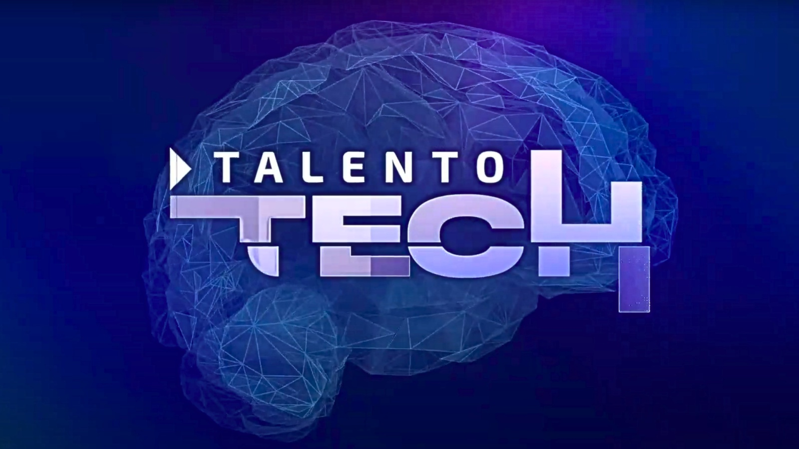

# TALENTOTECH 

# Taller de La Misión 1 - Programación Básica

Este repositorio contiene el proyecto desarrollado como parte del taller de la Misión 1 en Programación Básica. El objetivo principal de este taller fue crear una página web utilizando HTML y CSS para una empresa ficticia o modelo de negocio. En este caso, la página está orientada a promover el uso de la ruta de la UIS (Universidad Industrial de Santander), mostrando las paradas y permitiendo al usuario apartar su asiento.

## Descripción del Proyecto

La página web está diseñada para ofrecer información clara y útil sobre el sistema de transporte de la UIS. Los usuarios pueden consultar las paradas, conocer más sobre el servicio, leer testimonios de usuarios satisfechos, explorar un blog relacionado, y contactar a la empresa para resolver dudas o colaborar. Además, se proporciona una galería visual para resaltar las mejores características del servicio.

## Estructura de la Página Web

La página web incluye las siguientes secciones:

1. **Inicio**: Presentación del servicio de transporte y su objetivo principal.
2. **Nosotros**: Información sobre la empresa o modelo de negocio.
3. **Servicios / Productos**: Detalles sobre los servicios ofrecidos, como las rutas, paradas, y opción para apartar asientos.
4. **Testimonios / Casos de Éxito**: Comentarios de usuarios satisfechos y casos destacados.
5. **Blog / Noticias**: Artículos relacionados con el servicio y novedades.
6. **Contacto**: Formulario y datos de contacto para resolver dudas o realizar consultas.
7. **FAQs**: Respuestas a preguntas frecuentes sobre el uso del servicio.
8. **Trabaje con Nosotros**: Información para quienes deseen unirse al equipo.
9. **Galería**: Imágenes y videos que destacan las mejores características del servicio.

## Tecnologías Utilizadas

- **HTML5**: Para la estructura y el contenido de la página.
- **CSS3**: Para el diseño y la estilización visual de la página.

## Requisitos del Taller

Los criterios y parámetros evaluados en el taller incluyen:

1. La definición clara de una empresa o modelo de negocio.
2. Desarrollo completo de la página web utilizando HTML y CSS.
3. Inclusión de las secciones solicitadas en el enunciado del taller.

## Instrucciones para Ver el Proyecto

1. Clona este repositorio en tu equipo local:

   ```
   git clone https://github.com/chagor04/mision1.git
   ```

2. Abre el archivo `index.html` en tu navegador favorito para explorar la página.

## Autor

Participantes del grupo G71

## Notas Adicionales


